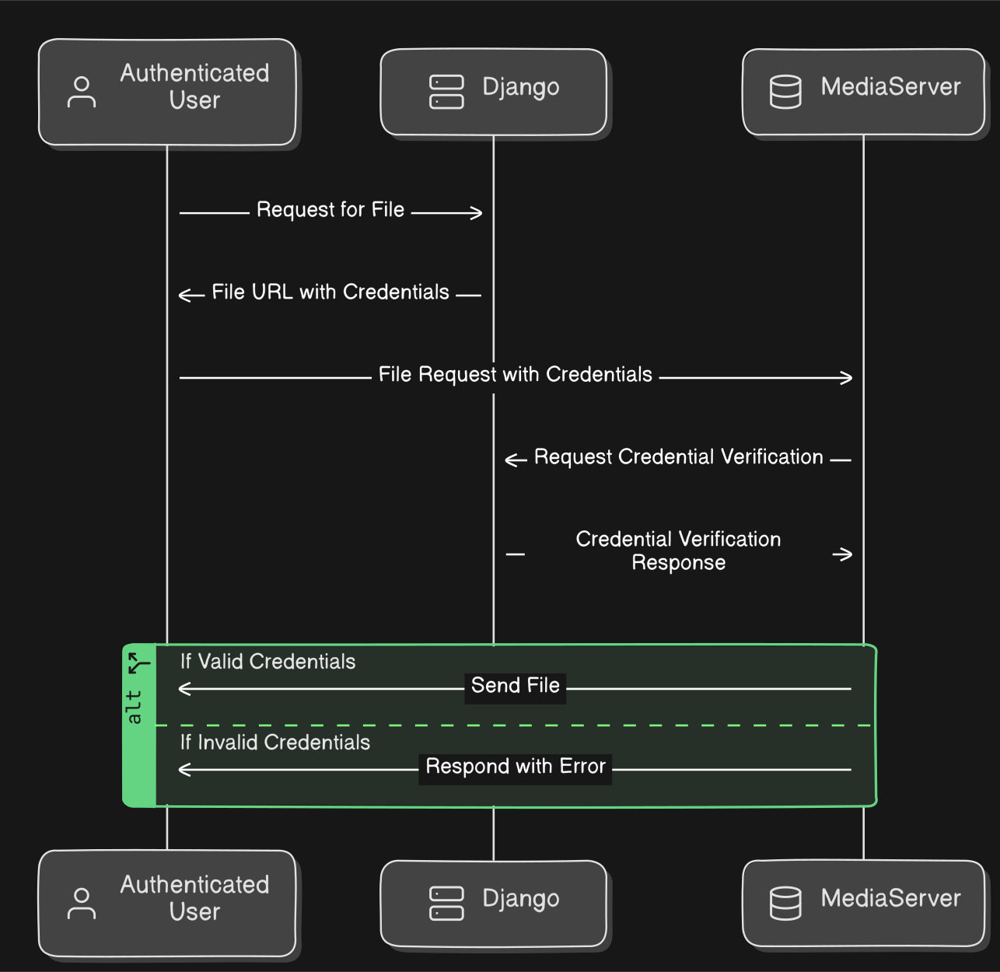

## DChat is a live chat application where you can chat with other users, send files, block/unblock users, update your profile information, and do a few other things. It uses WebSocket for a snappy experience and notifications.

## Architecture Overview

The application is built around the **Django** framework, and **PostgreSQL** is the DBMS. Every major part of the application is a separate docker image, which is supposed to run inside a docker swarm. When a user connects to the application through WebSocket, they connect to a single container, and to make communication possible between other users connected to other containers through **WebSocket**, **Redis** channel layer is used.

User-uploaded files are served from a separate docker container (i.e., the *MediaServer*), which is just an **Nginx** server that checks each request's authenticity using an endpoint on the main Django application.

**Celery** is configured but not used for anything.

# Account Management

Every user must have an account to access the functionality of the application. Users will be able to create an account on the sign-up page.

To create an account, you will have to provide an email address, a unique username, and a strong password.

- Currently, only format validation is performed on email addresses.

- Username cannot contain all characters. This is because the username is part of the channel group name for the user, and Redis has restrictions on channel group name characters. Allowed characters are ASCII alphanumerics, hyphens, underscores, and periods. The username also has restrictions on its length; a username has to be at least 4 characters long, and the maximum length can be 50 characters long.

- Password cannot be too similar to the username or email and has to be at least 8 characters long. The standard Django password validation applies.

# Email Verification

When a user submits a form for user creation, the Signup view automatically creates an email link that contains an HMAC value for the newly created user. This email will be sent to the provided email. When the user clicks on the provided link in the email, it will update the user email verification status. 

# Sending Text

Users can send text messages to other connected users. If the recipient user is not online, then the message is delivered to the recipient when they come online. All messages are stored in the database in **plain text**. On each connected user's profile picture, there will be a counter of unread messages.

# Sending File

Users can send any kind of file to other users. *Image mime-type* files will have a preview. Currently, there is **no limit** on file size, but a limit can be set very easily.

# Chat Request

Users can send chat requests to other users. To send a chat request, simply search for the user in the search section and click on them. If you are not connected to the requesting user, there will be an option to send a chat request.

When a chat request is sent, the recipient will get a notification through WebSocket. The recipient will have three options: **accept**, **reject** and **block**. If the recipient **rejects** the request, you will be to send chat request again.

# User Search

There is a section on the sidebar where you can search for existing users. The search query is matched on the 'Username' and the 'display name' fields. When users change their name from the profile, that changed name is called the **display name**.

# Live Notifications

Live notifications are instant visual updates on the user interface. There are no popup notifications. If a user sends a message to you and you are not focused on the sender, there will be an instant unread message counter update on the sender's profile picture. This is achieved using **WebSockets**. This instant update using **WebSocket** is also used when a new chat request is sent.

# Profile Management

Users will have the option to change their profile picture and the display name. When a new user is created, they will have a default profile picture, and their **Username** will be used as their display name. There is no restriction on how many times and how often they can change their display name and profile picture.

# Blocking Users

Upon receiving a chat request, users will have an option to **block** the sender. If the recipient chooses to block the sender, then the sender will not be able to resend the chat request. Blocked users can only be unblocked from the profile of the recipient user. If the blocker wants to start communication with the blocked user, then the blocker has to first unblock the user from their profile.

# Redis Channel Layer

The Redis Channel Layer is used to handle group and channel creation.

# Nginx Media Server

For serving user-uploaded files, a separate Nginx container is used as a MediaServer. The **Nginx** `auth_request` module is used to forward each file access request URI to an endpoint in the Django application, only if the Django endpoint returns a 200 OK HTTP response, then the requested file is served by the MediaServer.

The actual uploaded file data is stored inside a docker volume, and this volume is mounted to `/storage` with read-only access.

For file access authentication, a custom HMAC-based authentication system is used.

# PostgreSQL Database

PostgreSQL is used for everything related to data storage, except for file storage, for which file storage is used.

**Here is an overview of the model relationship in DChat.** *It's an SVG image you can zoom in infinitely*

# Docker Swarm

#### **Seven** docker containers are used to build this application along with one Database volume and one file storage volume. These seven containers are run in a docker swarm.

1. **Django Application Container:** The main application where all application logic is implemented. Other containers satisfy the requirements of this container.

2. **PostgreSQL Container:** This container runs PostgreSQL to store user data, messages, and other types of data. There will be only one container of PostgreSQL for data consistency.

3. **Redis Container:** Redis is used for inter-container communication using the Redis channel layer. There will be only one instance of this container for proper inter-container communication.

4. **Celery Container:** This container will be used to offload background tasks.

6. **MediaServer Container:** All uploaded files are served from this container.

7. **NginxServer Container:** The entry-point server to the docker swarm, it is a reverse proxy to proxy incoming requests to the appropriate container running inside the swarm.
